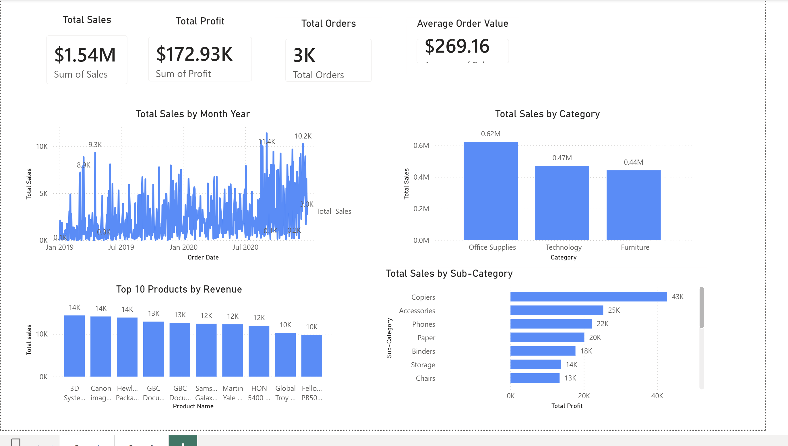
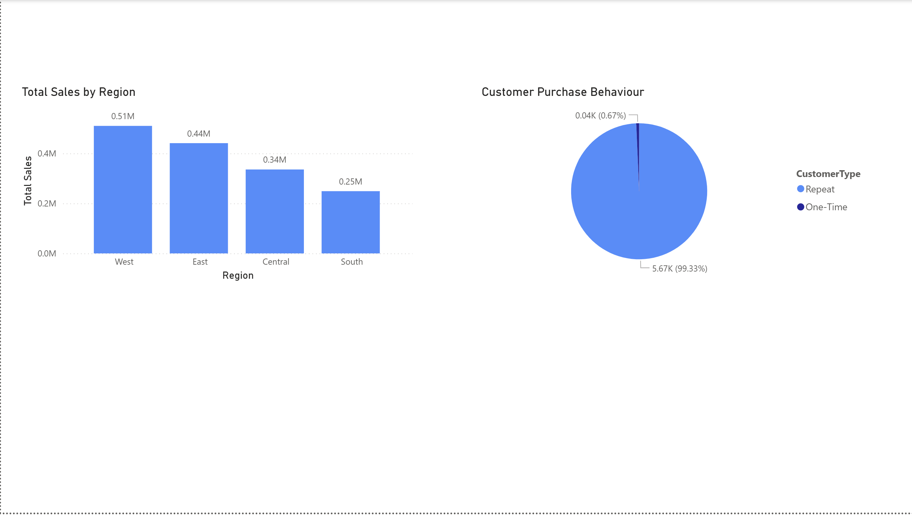

# Sales Performance Dashboard (Power BI)

## Overview
Developed an end-to-end interactive sales analytics dashboard in Power BI to evaluate retail performance across regions, product categories, and customer segments.

## Highlights
- Executive KPIs: Total Sales, Total Profit, Total Orders, Average Order Value
- Interactive slicers and drill-down exploration by region and category
- Revenue concentration analysis highlighting top-performing products and sub-categories
- Designed for executive-level performance monitoring and decision support

## Dashboard Preview

### Page 1

### Page 2

## Data Source
Retail transaction dataset (5,700+ records) analyzed for regional and product-level performance insights.

## Tools
Power BI, MySQL, Excel

## Files
- `.pbix` — Power BI report file
